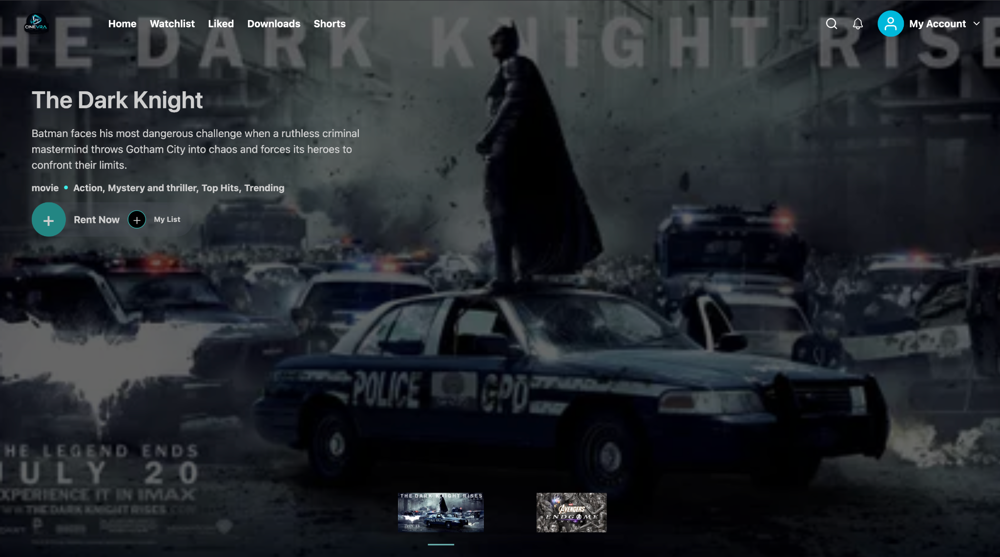
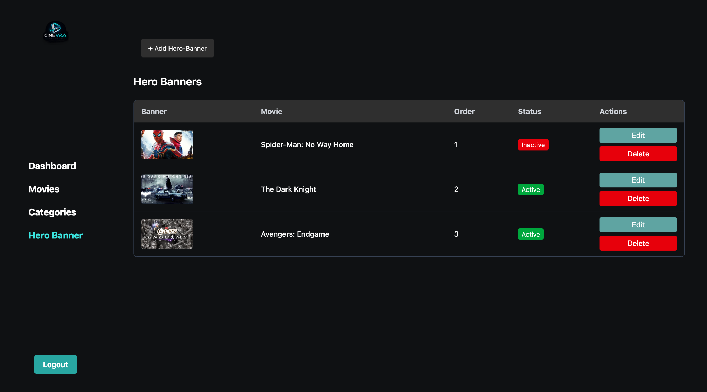
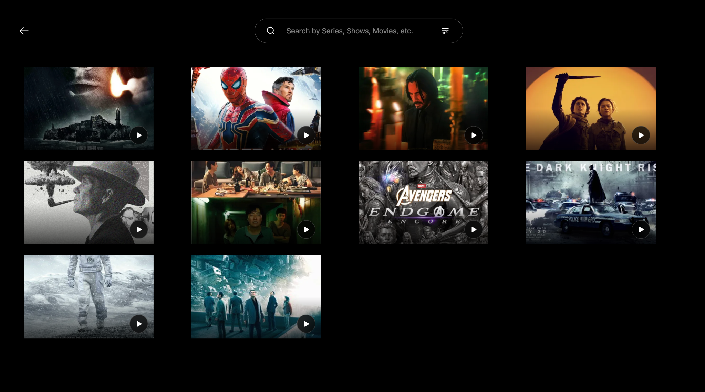
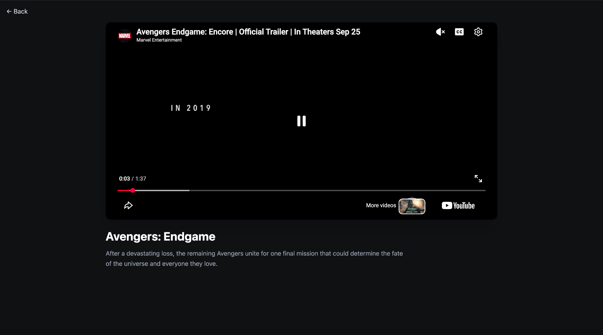
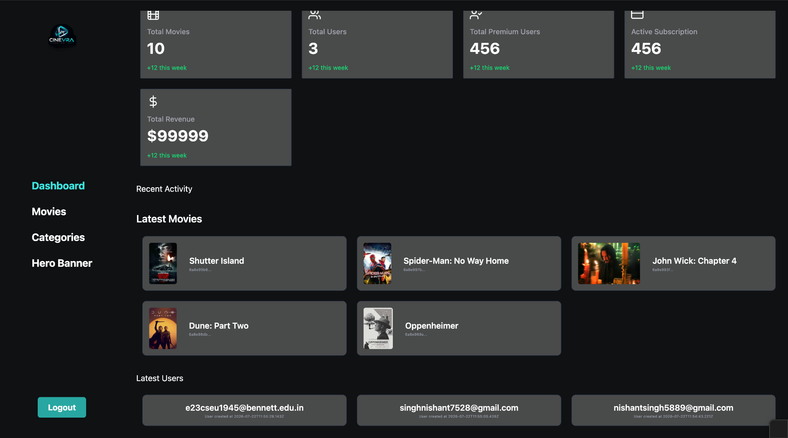
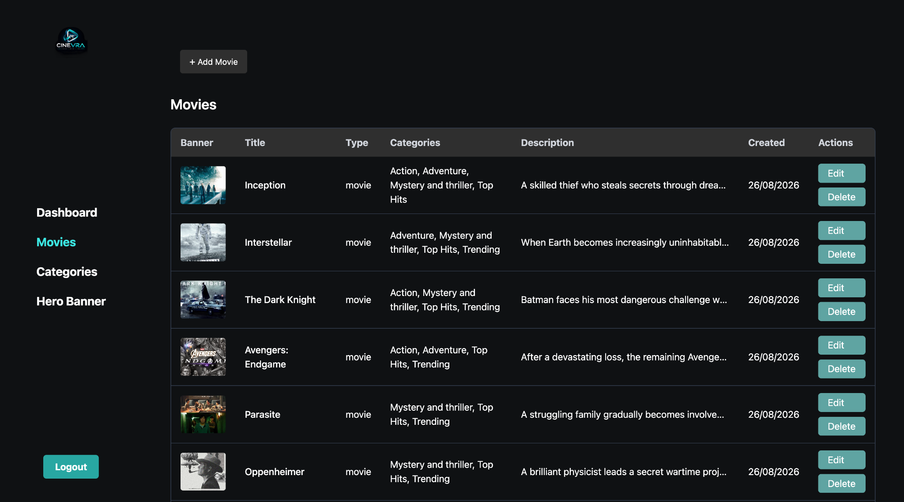
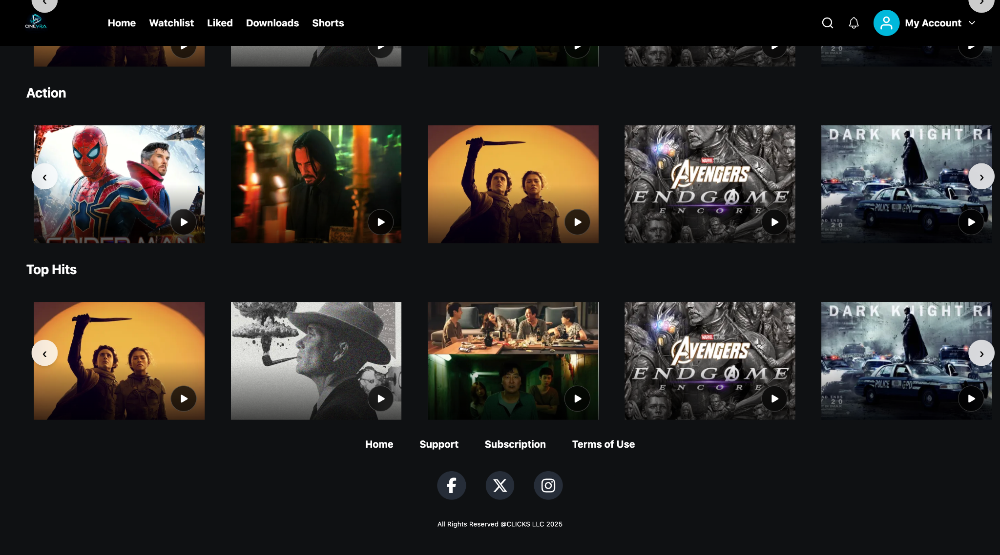
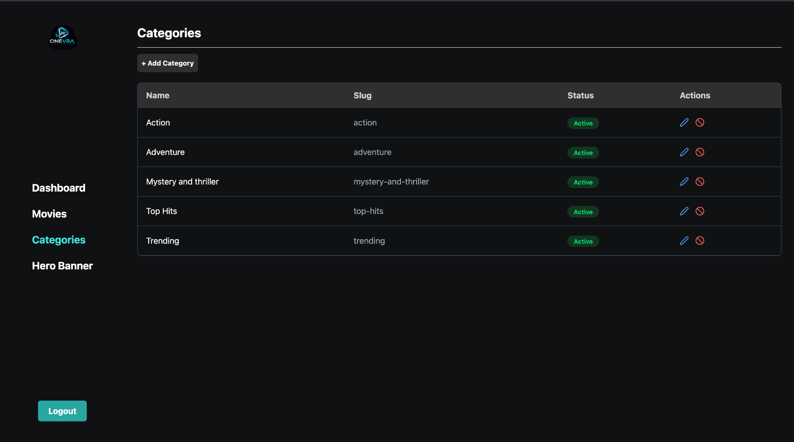

# OTT Streaming Platform

A full-stack OTT streaming platform developed during my MERN Stack internship at On-Graph Technologies Pvt. Ltd.

The platform provides users with a streaming experience while offering an admin dashboard for managing movies, categories, hero banners, and platform content.

## Features

### User Features

- User registration and login
- Authentication and protected routes
- Browse and search movies
- Movie filtering
- Movie playback
- Like and unlike movies
- Add and remove movies from watchlist
- View liked movies
- View watchlist
- Subscription management
- User account settings
- Downloads section

### Admin Features

- Admin authentication and authorization
- Admin dashboard
- Movie management
- Add, edit, and delete movies
- Category management
- Hero banner management
- Dashboard statistics
- Latest movie and user information
- Media upload management

## Tech Stack

### Frontend

- React.js
- JavaScript (ES6+)
- Tailwind CSS
- React Router
- Axios
- Vite

### Backend

- Node.js
- Express.js
- MongoDB
- Mongoose
- REST APIs

### Cloud & Storage

- AWS S3
- Multer

### Tools

- Git
- GitHub
- ESLint

## Project Structure

```text
ott-streaming-platform/
│
├── OTT-backend/
│   ├── config/
│   ├── controllers/
│   ├── middlewares/
│   ├── models/
│   ├── routes/
│   ├── services/
│   ├── index.js
│   └── package.json
│
├── OTT-frontend/
│   ├── public/
│   ├── src/
│   │   ├── admin/
│   │   ├── api/
│   │   ├── assets/
│   │   ├── components/
│   │   ├── pages/
│   │   ├── services/
│   │   └── utils/
│   ├── index.html
│   └── package.json
│
└── README.md
```

## Application Architecture

```text
                    ┌─────────────────────┐
                    │   React Frontend    │
                    │       Vite          │
                    └──────────┬──────────┘
                               │
                          REST APIs
                               │
                               ▼
                    ┌─────────────────────┐
                    │  Node.js + Express  │
                    │       Backend       │
                    └──────────┬──────────┘
                               │
                  ┌────────────┴────────────┐
                  │                         │
                  ▼                         ▼
           ┌──────────────┐          ┌──────────────┐
           │   MongoDB    │          │    AWS S3    │
           │ Application  │          │    Media     │
           │     Data     │          │   Storage    │
           └──────────────┘          └──────────────┘
```

## Screenshots

### Home



### Hero Section



### Search



### Movie Player



### Admin Dashboard



### Movie Management



### Categories



### Category Section



## Getting Started

### Prerequisites

Make sure you have the following installed:

- Node.js
- npm
- MongoDB
- Git

### Clone the Repository

```bash
git clone git@github.com:NS9948/ott-streaming-platform.git
cd ott-streaming-platform
```

### Backend Setup

```bash
cd OTT-backend
npm install
```

Create a `.env` file inside `OTT-backend` and configure the required environment variables.

Example:

```env
PORT=5000
MONGODB_URI=your_mongodb_connection_string
JWT_SECRET=your_jwt_secret
AWS_ACCESS_KEY_ID=your_aws_access_key
AWS_SECRET_ACCESS_KEY=your_aws_secret_key
AWS_REGION=your_aws_region
AWS_BUCKET_NAME=your_bucket_name
```

Start the backend:

```bash
npm start
```

### Frontend Setup

Open another terminal:

```bash
cd OTT-frontend
npm install
npm run dev
```

The frontend will start using the Vite development server.

## Environment Variables

Sensitive environment variables are intentionally excluded from this repository.

Never commit:

- Database credentials
- JWT secrets
- AWS access keys
- API keys
- `.env` files
- Other private credentials

## Internship Project

This project was developed during my **MERN Stack internship at On-Graph Technologies Pvt. Ltd.**

**Duration:** July 2026 – August 2026

## Author

**Nishant Singh**

- GitHub: https://github.com/NS9948
- LinkedIn: https://linkedin.com/in/nishant-singh-a95796314
